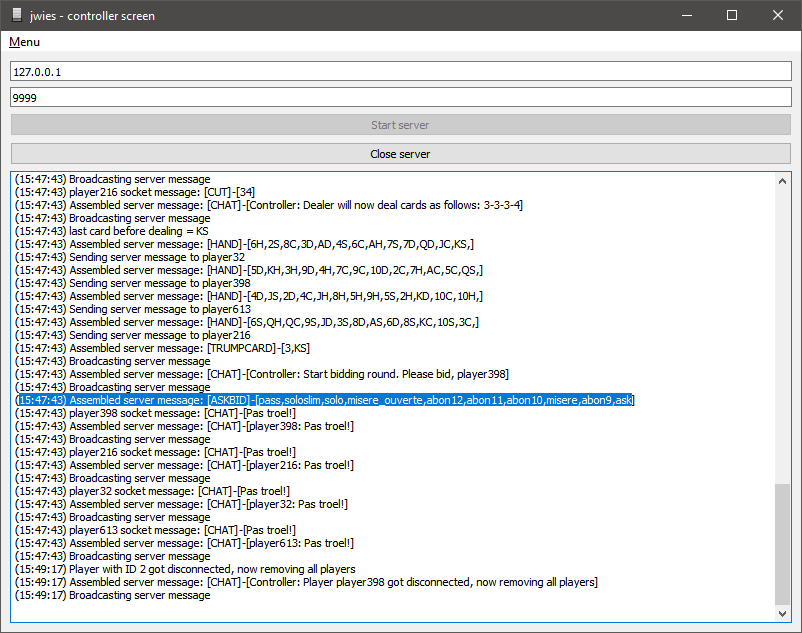
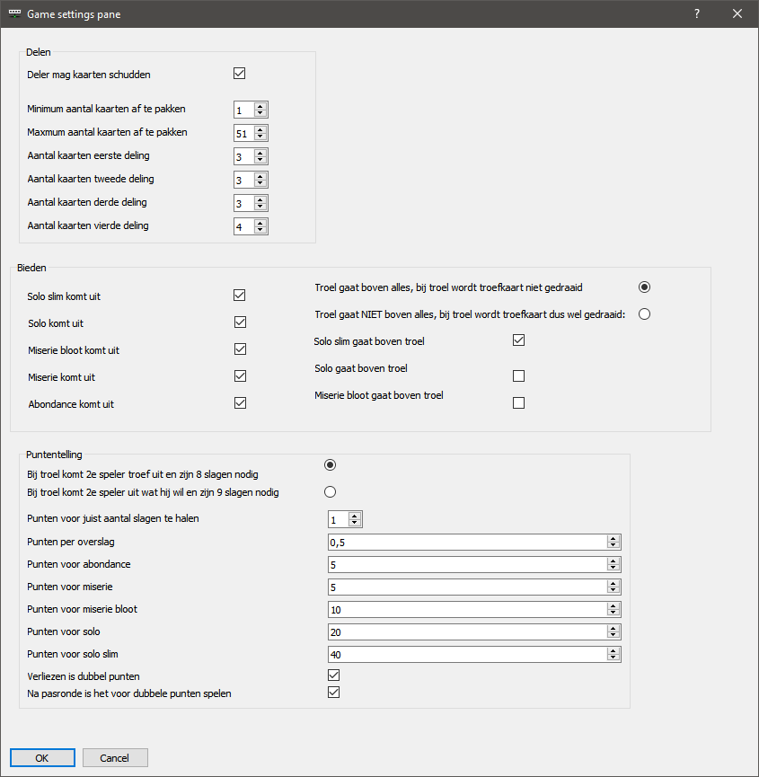
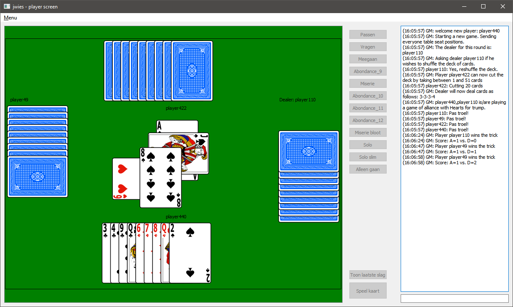

# jwies
Flemish whist multiplayer application built in python 3 and Qt.  
Based on a server-client architecture.

## Controller
The controller (=server) is the game master.  
It contains all the game logic.  
Information is sent to the clients on a need to know basis.
  


De controller heeft veel settings, om de lokale varianten en spelregels van wiezen te ondersteunen.
  


## Client
The client is the player's graphical game client.  
The GUI consists of a scalable playing field and a text chat.
  


## Card game terms 
| English        	| Dutch         	|
|----------------	|---------------	|
| deck           	| dek           	|
| cut the deck   	| dek splitsen  	|
| shuffle        	| schudden      	|
| suit           	| kleur         	|
| hearts         	| harten        	|
| diamonds       	| koeken        	|
| clubs          	| klaveren      	|
| spades         	| schoppen      	|
| jack           	| boer          	|
| queen          	| dame          	|
| king           	| heer          	|
| ace            	| aas           	|
|                	|               	|
| deal           	| delen         	|
| redeal         	| herdelen      	|
|                	|               	|
| auction        	| biedronde     	|
| bieden         	| bid           	|
| ask            	| vragen        	|
| follow suit    	| volgen        	|
| pass           	| passen        	|
| abundance      	| abondance     	|
| misere         	| miserie       	|
| misere ouverte 	| miserie bloot 	|
|                	|               	|
| turn           	| beurt         	|
| trick          	| slag          	|
| play           	| spel / spelen 	|
| trump          	| troef         	|
| discard        	| weggooien     	|
| trump          	| overgaan      	|
| under-play     	| ondergaan     	|

## How to run your own development copy
```
get python3.8 
> git clone https://github.com/jorritvm/jwies
> cd jwies # Enter to project directory
> py -3 -m venv .venv # create virtualenv
> .venv/bin/activate # Activating virtualenv
(.venv)> pip install -r ./src/requirements.txt # Installing dependencies
(.venv)> python src/player_main.py
```