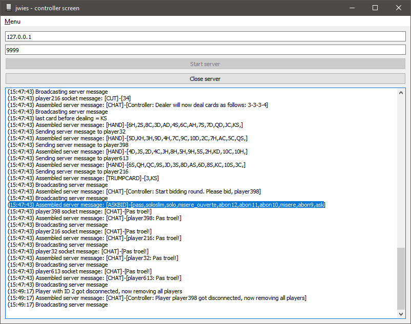
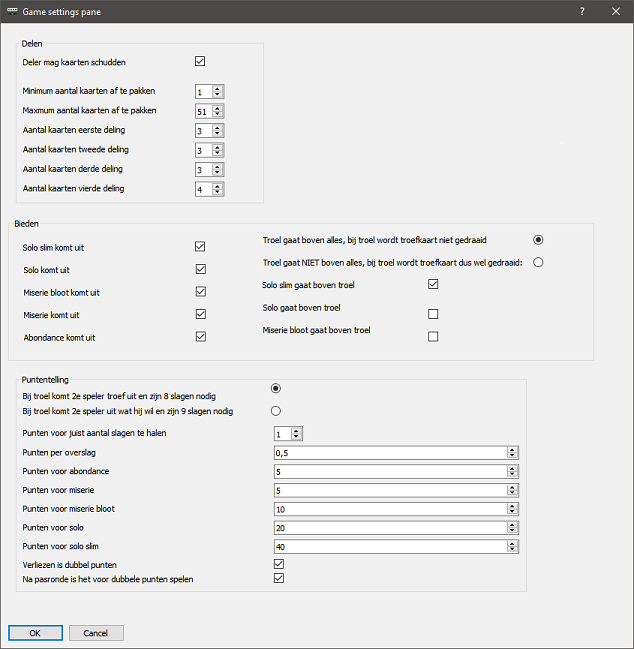
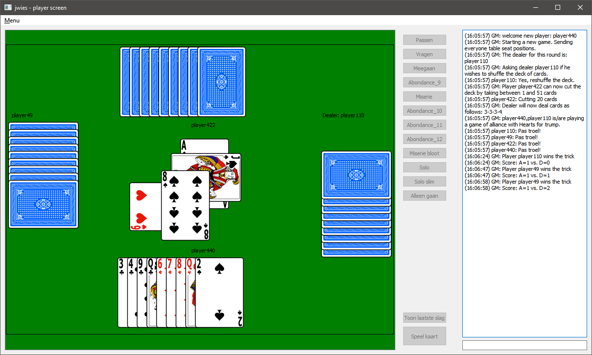

# jwies
Flemish whist (wiezen) multiplayer application built in Python 3 and PyQt6.
Based on a server-client architecture.

<!-- TOC -->
* [jwies](#jwies)
  * [Controller](#controller)
  * [Client](#client)
  * [Development setup](#development-setup)
  * [Running the application](#running-the-application)
  * [Author](#author)
<!-- TOC -->

## Controller & Client


| Description | Screenshot |
|----------------------------------------------------------------------------------------------------------------------------------------------------|----|
| The controller (=server) is the game master. <br> It contains all the game logic.<br />Information is sent to the clients on a need to know basis. |  [](docs/screenshots/controller_main_window.png)  |
| The controller has many settings to support local variants of the game.                                                                            | [](docs/screenshots/controller_configuration.png)  |
 | The client is the player's graphical game client.<br />The GUI consists of a scalable playing field and a text chat. |  [](docs/screenshots/player_main_window.png) |


## Development setup
This project uses [uv](https://docs.astral.sh/uv/) for Python and dependency management.

```shell
# clone the repository
git clone https://github.com/jorritvm/jwies
cd jwies

# create the virtual environment and install all dependencies
# (uv also installs the pinned python version from .python-version if needed)
uv sync
```

## Running the application
Always run from the project root:

```shell
# start the controller (server)
uv run src/controller_main.py

# start a player client (one per player, 4 needed for a game)
uv run src/player_main.py
```

Convenience scripts for local testing on Windows:

```shell
run_1s_3c.bat   # starts 1 controller + 3 player clients
run_4c.bat      # starts 4 player clients
```

```shell
uv run scripts/build_ui.py
```

## Author
Jorrit Vander Mynsbrugge