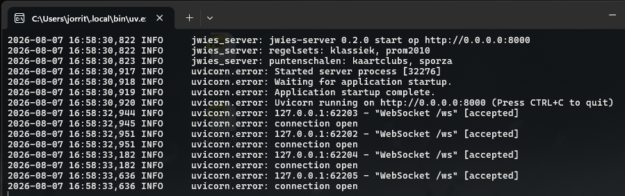
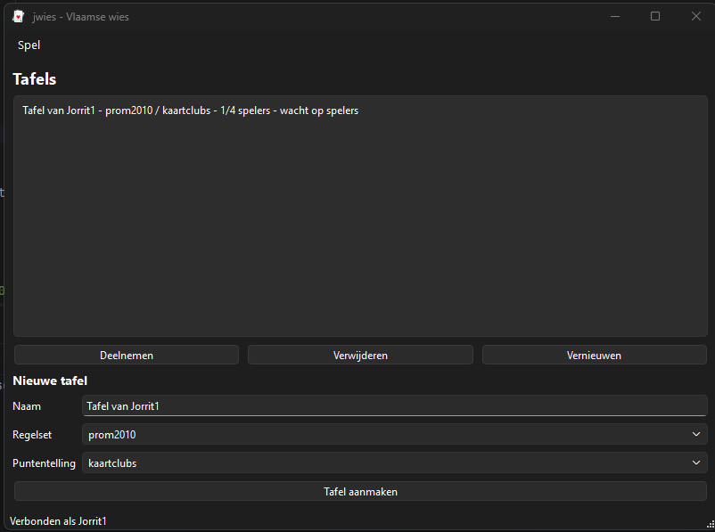
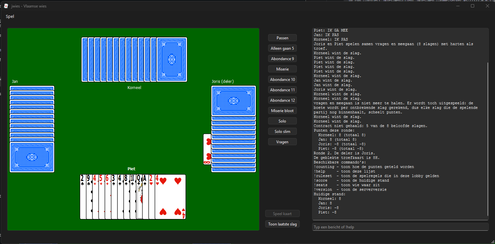
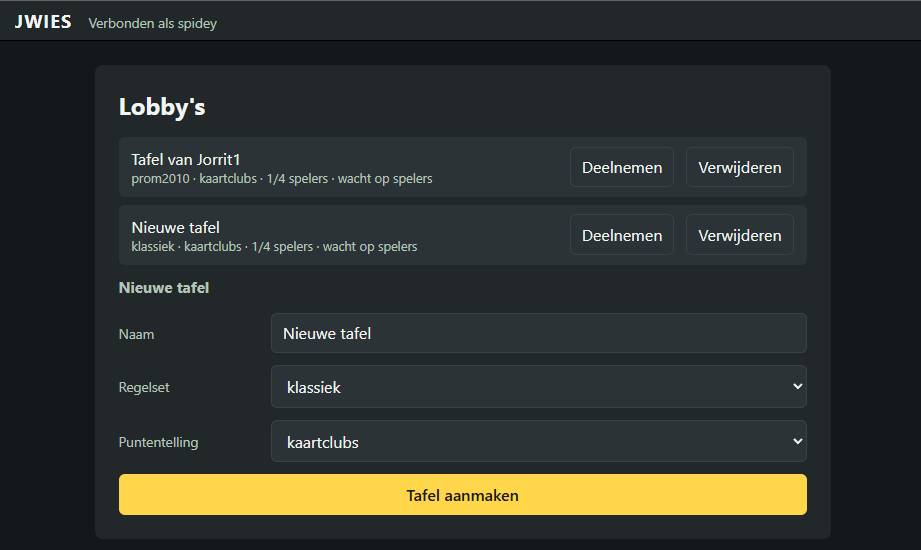
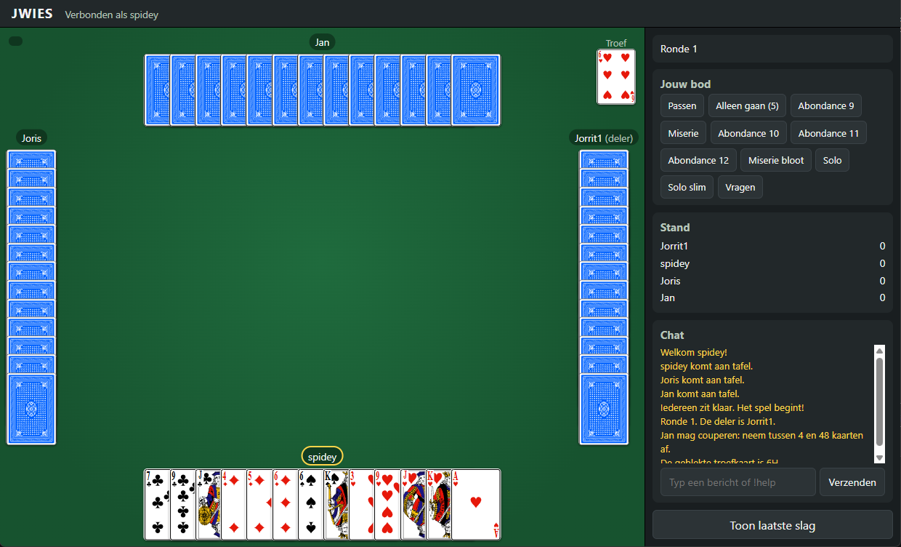

# jwies

Vlaamse wies (traditioneel wiezen) om online te spelen met vier personen.

Een headless server host meerdere tafels tegelijk. Spelers sluiten aan met de
**browser** of met de **PyQt-client**, aan dezelfde tafel. Valt
iemands verbinding weg, dan pauzeert het spel en wacht het op hem.

## Screenshots

| Wat              | Screenshot                                                                                |
|------------------|-------------------------------------------------------------------------------------------|
| server cli       |        |
| qt client lobby  |    |
| qt client game   |      |
| web client lobby |  |
| web client game  |    |

## Documentatie
- De spelregel en handleiding staan uitgebreid beschreven in [`docs/game/`](docs/game/)
- De architectuur (geheel en per module) en het protocol staan beschreven in [`docs/architecture/`](docs/architecture/).
- De ontwikkelaarsdocumentatie staat in [`docs/development/`](docs/development/).

## Licenties
De code staat onder de licentie in [LICENSE](LICENSE).  
De kaartafbeeldingen zijn **SVG-cards 2.0.1** van David Bellot, onder de LGPL.

## Auteur
Jorrit Vander Mynsbrugge

