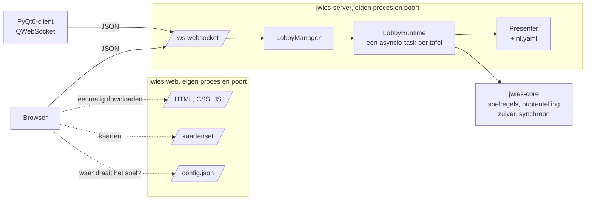
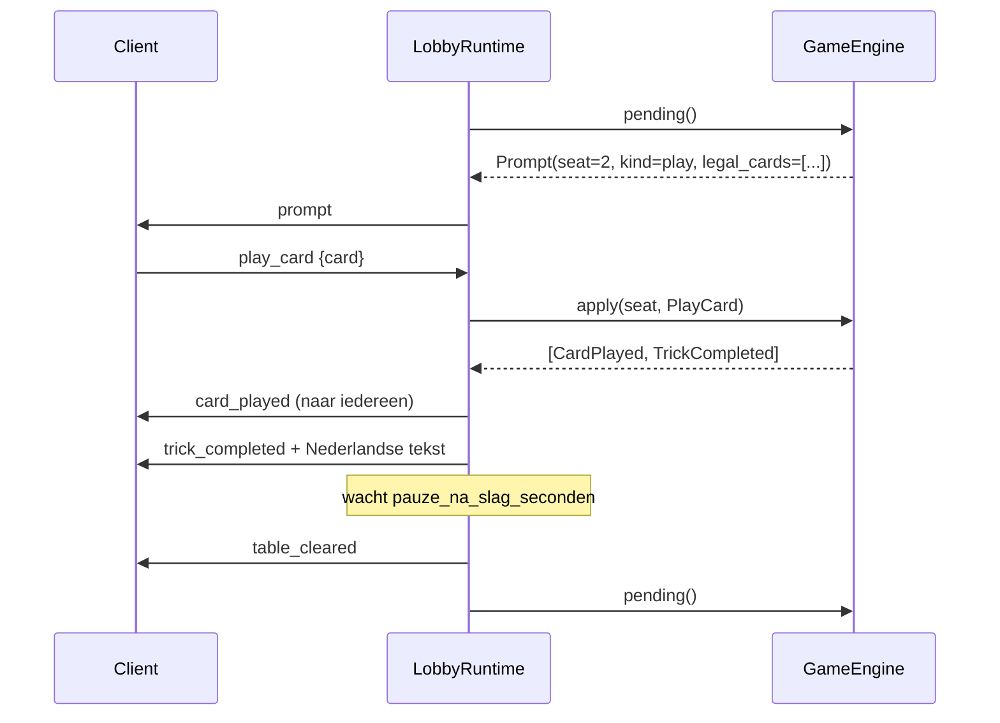

# Architectuur

## Overzicht



De twee processen weten niets van elkaar. `jwies-web` deelt bestanden uit en
kent de spelregels niet; `jwies-server` speelt het spel en deelt geen bestanden
uit. Ligt de spelserver plat, dan laadt de pagina nog altijd - ze zal enkel
melden dat ze het spel niet bereikt.

Omdat de pagina van een ander adres komt dan de websocket, moet de browser
weten waar het spel draait. Volgorde: wat de speler zelf invulde,
`?server=...`, `game_server_url` uit `/config.json`, en anders dezelfde host als
de pagina.

## De vijf pakketten

| Pakket | Rol |
|---|---|
| `jwies-core` | Alle spelregels en de puntentelling. Geen I/O, geen async, geen Qt, geen timers. |
| `jwies-protocol` | Het berichtenschema als pydantic-modellen. Geen spellogica, geen import van core. |
| `jwies-web-client` | De browserclient (HTML, CSS, JS) plus de webserver die hem uitdeelt, inclusief de kaartenset. |
| `jwies-server` | Lobby's, sessies, websockets, chat. Deelt geen bestanden uit. |
| `jwies-qt-client` | De desktopclient, met een eigen kopie van de kaartenset (SVG-cards 2.0.1) en de iconen. |

Tests bewaken dat `jwies-server` nooit PyQt binnentrekt, `jwies-qt-client` nooit
FastAPI, en `jwies-web-client` nooit `jwies-core` of `jwies-protocol` - die
laatste kent de spelregels niet en hoort ze ook niet te kennen.

Er zit geen npm, bundler of transpilatie tussen: wat in de repo staat, is wat de
browser krijgt. `jwies-web-client` is een Python-pakket omdat dat de
eenvoudigste manier is om die bestanden mee te verhuizen naar waar ze
uitgeserveerd worden; `importlib.resources` vindt ze evengoed in een wheel of
een containerimage als in een checkout.

## Drie principes die de rest verklaren

**1. De engine is zuiver.** `GameEngine.apply(seat, action)` geeft een lijst
gebeurtenissen terug en raakt niets buiten zichzelf aan. Alle wachttijden
(zoals de twee seconden dat een volle slag blijft liggen) zitten in de server.
Daardoor is elke regelvariant een unittest, en kan een AI later een engine
kopieren om varianten door te rekenen. `tests/core/test_purity.py` dwingt dit af.

**2. De beurt draagt de toegelaten zetten.** De server stuurt bij elke beurt
een `prompt` mee met `legal_cards` of `bid_options`, berekend door
`legal_moves()` en `BidLadder.options_after()`. Geen enkele client leidt zelf
af wat kleur volgen betekent. Dat is waarom een browser en een PyQt-venster
nooit van mening kunnen verschillen.

**3. De momentopname is het volledige contract.** `Snapshot` bevat alles wat
een speler mag weten: zijn hand, de tafel, de biedgeschiedenis, het contract,
de lopende slag, de stand, en of hij aan zet is. Beide clients kunnen een
volledige tafel tekenen uit alleen een snapshot; de losse gebeurtenissen zijn
er enkel voor de animatie. Daarom is herverbinden gratis.

## Een beurt, van begin tot eind



## Wegvallen en terugkomen

De gebruikersnaam is de sleutel. Bij het eerste contact krijgt een speler een
`resume_token`; komt hij terug met dezelfde naam, dan krijgt hij zijn stoel
terug.

```
VERBONDEN --(socket dicht)--> WEG
    de engine wordt NIET aangeraakt: pending() wijst nog naar wie moet
    lobby.status = PAUSED, iedereen krijgt game_paused
WEG --(hello, zelfde naam)--> VERBONDEN
    hello_ok -> lobby_state -> snapshot   (volledige resync)
    is niemand meer weg: game_resumed + prompt opnieuw uitgeven
WEG --(na stoel_vrijgeven_na_minuten)--> stoel vrij
```

Omdat `pending()` idempotent is, is "de beurt opnieuw uitgeven" gewoon een
tweede aanroep. De server houdt nooit bij dat hij iemand al iets gevraagd heeft.

Tijdens een pauze blijven chat, `request_snapshot` en `ping` werken; al de rest
antwoordt met `game_paused`.

## Ruimte voor een AI-speler

Nog niet gebouwd, maar de naad ligt klaar. `LobbyRuntime` haalt
`(agent, bericht)` uit een wachtrij en kan niet zien waar een bericht vandaan
komt. Een `WebsocketAgent` is een producent op die wachtrij; een AI zou een
tweede zijn.

Wat er dan nog moet gebeuren: `AgentFactory.create()` implementeren, publiceren
onder het entry point `jwies.agents`, en `lobby_start{fill_with_agent}` gebruiken.
De server krijgt daarbij nooit een afhankelijkheid op het AI-pakket.

Dat dit goedkoop blijft, hangt aan de drie principes hierboven: de engine is
kopieerbaar, de toegelaten zetten komen kant-en-klaar mee, en `view_for(seat)`
is tegelijk de herverbind-payload, de tekeninvoer van de webclient en de
observatie van een AI.

## Het protocol

Elk bericht zit in een envelop:

```json
{"v": 1, "id": "7", "msg": {"type": "play_card", "card": "AH"}}
```

De server antwoordt met `{"v":1,"seq":42,"re":"7","ts":"...","msg":{...}}`.
`seq` loopt op per verbinding; een gat betekent dat de client iets miste en
een nieuwe snapshot moet vragen. `re` verwijst naar de `id` van het bericht dat
het antwoord uitlokte.

De volledige berichtenlijst staat in
`packages/jwies-protocol/jwies_protocol/client_messages.py` en `server_messages.py`.
Dat zijn pydantic-modellen met een discriminator op `type`, dus een onbekend
berichttype is een validatiefout en geen stilzwijgend genegeerd bericht.

## Wat er van de oude versie overbleef

| Oud | Nieuw |
|---|---|
| `controller_table.find_out_who_won` | `jwies_core.trick.trick_winner` |
| `controller_table.validate_and_add_card_to_trick` | `jwies_core.trick.legal_moves` (omgekeerd: berekent de toegelaten set) |
| `controller_table.get_remaining_bid_options` | `jwies_core.bidding.BidLadder` |
| `controller_table.divide_teams` (125 regels if/elif) | `jwies_core.contracts.CONTRACT_CATALOG` + `resolution.resolve_contract` |
| `controller_table.process_game` drempels | data in `CONTRACT_CATALOG` |
| `player_main.bid()` Nederlandse teksten | `jwies_server/texts/nl.yaml` |
| `constants.py` stoelgeometrie | `jwies_qt_client/layout.py` |
| `controller_main.py` (GUI, QTcpServer) | volledig vervangen |
| pydealer | `jwies_core.cards` |
| QDataStream over QTcpSocket | JSON over websockets |
