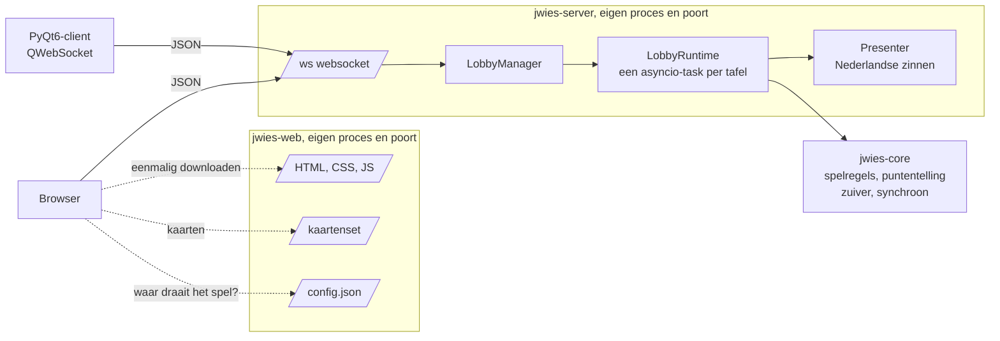
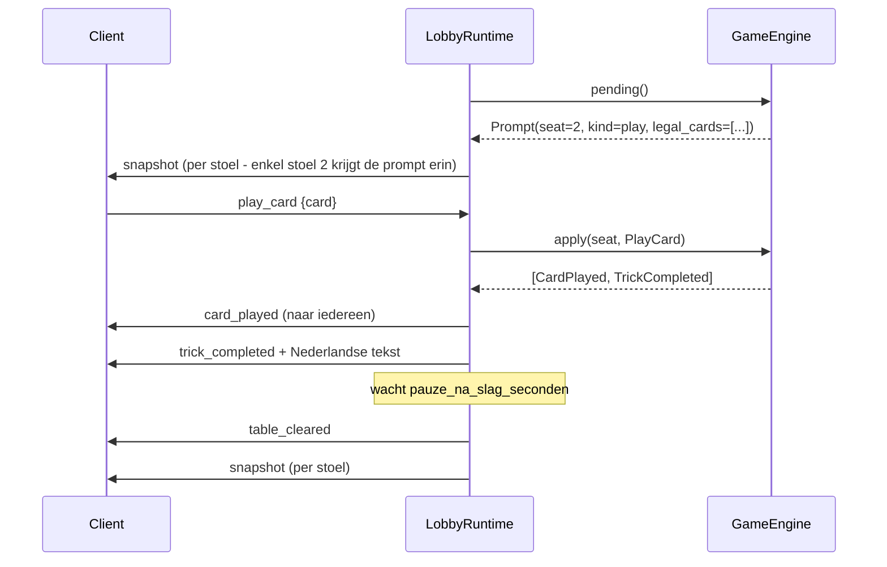

# Architectuur

Dit is een overzichtspagina die toont welke processen er draaien, wat elk pakket
doet, en hoe een beurt van client tot engine en terug loopt.  
Voor de module-per-module details, zie de pakketdocumenten waarnaar hieronder wordt
verwezen.

## De drie projecten

Drie projecten, elk met hun eigen venv en afhankelijkheden:

| Project | Rol | Entrypoint |
|---|---|---|
| [`jwies-server`](packages/jwies-server.md) | Spelregels ([`jwies_core`](packages/jwies-core.md)), puntentelling, lobby's, sessies, websockets, chat, en het berichtenschema. | `jwies-server --config ...` |
| [`jwies-qt-client`](packages/jwies-qt-client.md) | De desktopclient. Tekent wat de server stuurt. | `jwies --username ... --server ...` |
| [`jwies-web-client`](packages/jwies-web-client.md) | De browserclient (HTML, CSS, JS) plus de webserver die hem uitdeelt. | `jwies-web --game-server ...` |


## Processen




## Onafhankelijkheid server en client

Server en clients zijn drie volledig onafhankelijke uv-projecten, elk met een
eigen dependency-graph; `uv tree` per project bevestigt dat (zie
[instructions.md](../development/contributing.md)).


## Drie principes die de rest verklaren

**1. De engine is zuiver.** `GameEngine.apply(seat, action)` geeft een lijst
gebeurtenissen terug en raakt niets buiten zichzelf aan. Alle wachttijden
(zoals de twee seconden dat een volle slag blijft liggen) zitten in de server.
Daardoor is elke regelvariant een unittest. `tests/core/test_purity.py` dwingt
dit af.

**2. De beurt draagt de toegelaten zetten.** De server stuurt bij elke beurt
een `prompt` mee met `legal_cards` of `bid_options`. Geen enkele client leidt
zelf af wat kleur volgen betekent. Dat is waarom een browser en een
PyQt-venster nooit van mening kunnen verschillen.

**3. De momentopname is de enige toestand.** `Snapshot` bevat alles wat een
speler mag weten. Na elke verandering krijgt elke stoel er een - het is niet
iets dat je opvraagt, het is hoe de tafel eruitziet. Al de rest wat de server
stuurt zijn mededelingen die niets dragen dat een client moet onthouden, op
drie na: `card_played`, `trick_completed` en `table_cleared` overbruggen het
moment tussen het winnen en het oprapen van een slag. Herverbinden is daardoor
gratis: er komt gewoon een nieuwe momentopname.

## Een beurt, van begin tot eind



Merk op dat er geen apart `prompt`-bericht is. Wie aan zet is en met welke
zetten staat in de snapshot, en alleen in die van de speler zelf.

Voor wat er gebeurt als een speler wegvalt en terugkomt, zie
[`jwies-server.md`](packages/jwies-server.md).

## Het protocol
Beide clients bouwen de JSON met de hand op en lezen hem met de hand terug. Het
berichtenschema is het contract van de server met zichzelf en woont daarom *in*
`jwies-server`.

Elk bericht zit in een envelop:

```json
{"v": 2, "msg": {"type": "play_card", "card": "AH"}}
```

De server antwoordt met `{"v":2,"seq":42,"msg":{...}}`. `seq` loopt op per
verbinding; een gat betekent dat de client iets miste en een nieuwe momentopname
moet vragen.

**Het volledige protocol staat in [`protocol.md`](protocol.md)** - elk
bericht, elk veld, elke foutcode. Dat document is het contract voor wie een
client schrijft. De meegeleverde clients bouwen hun JSON ook gewoon met de hand op.
